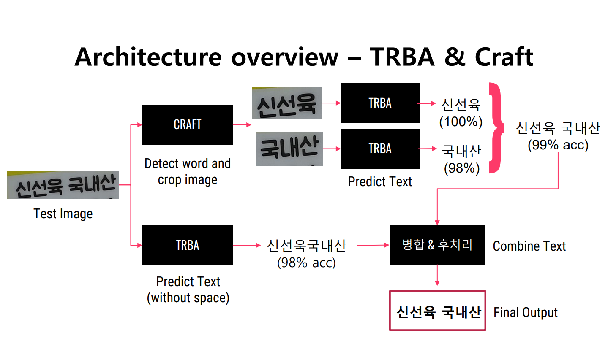

# SW중심대학 OCR 경진대회

## Solution Overview


## Team member
정재윤

## Code Running Environment
> ## run at local
> **use docker image of paperspace gradient Scratch docker**
> https://hub.docker.com/r/paperspace/gradient-base \
> \
> **docker tag** \
> pt112-tf29-jax0314-py39-20220803

## 모델 학습

### Data preprocess
https://dacon.io/competitions/official/235970/overview/description
대회 데이터셋 내부 Train, Test 이미지 및 csv 파일을 사용함.

open.zip을 data_process 폴더 내부에 압축 해제한다.

이후 AI HUB에서 제공하는 야외 실제 촬영 한글 이미지 데이터셋에서 가로형간판1, 가로형간판2, 세로형간판, 돌출간판, 책표지 데이터 전부 및 train 라벨 파일을 다운받고, data_process 폴더 내부에 다음과 같이 이름을 바꾸어 압축해제한다.

https://www.aihub.or.kr/aihubdata/data/list.do?currMenu=115&topMenu=100&searchKeyword=%ED%95%9C%EA%B8%80%20%EC%9D%B4%EB%AF%B8%EC%A7%80

[원천]Training_간판_가로형간판_원천데이터1 -> 가로형간판_원천데이터1

[원천]Training_간판_가로형간판_원천데이터2 -> 가로형간판_원천데이터2

[원천]Training_간판_세로형간판_원천데이터 -> 세로형간판_원천데이터

[원천]Training_간판_돌출간판_원천데이터1 -> 돌출간판_원천데이터1

[원천]Training_책표지1 -> 책표지1

[원천]Training_책표지2 -> 책표지2

[원천]Training_책표지3 -> 책표지3

[라벨]Training -> 폴더없이 압축풀어서 1.간판과 2.책표지 폴더가 data_process 폴더 내부에 위치하도록 한다.

데이터를 모두 data_process 폴더 내부에 세팅했다면 
```
Cutter.ipynb 
```
파일을 실행해 data_process 작업을 실행한다.

이후 train2 폴더에는 train image들이, gt_train과 gt_validation에는 train/valid label 정보와 img path가 저장된다. (txt 파일은 utf-8로 인코딩되어야함)

### TRBA 모델 학습하기

deep-text-recognition-benchmark 폴더 내부 data 폴더 안에 Data preprocess 폴더 내부 전처리를 거친 이미지가 담긴 train2 폴더, gt_train, gt_validation 파일을 옮긴다.

이후 코드를 돌리기 전 우선 require 라이브러리를 설치한다.

```
pip install lmdb pillow nltk natsort fire
```

이후 train 데이터셋과 valid 데이터셋을 LMDB 파일로 생성한다.
(터미널 경로가 deep-text-recognition-benchmark 내에 있어야함.)

```
python create_lmdb_dataset.py --inputPath data/ --gtFile data/gt_train.txt --outputPath data_lmdb/train
```

```
python create_lmdb_dataset.py --inputPath data/ --gtFile data/gt_validation.txt --outputPath data_lmdb/validation
```

이후 학습한다.

```
CUDA_VISIBLE_DEVICES=0 python3 train.py --train_data data_lmdb/train --valid_data data_lmdb/validation --Transformation TPS --FeatureExtraction ResNet --SequenceModeling BiLSTM --Prediction CTC --data_filtering_off
```

120000 epoch 학습이 완료된 pth 파일을 사용한다.

## 모델 예측

### CRAFT 모델을 사용한 단어 자르기

네이버에서 학습한 pretrained weight를 사용한다.

> https://drive.google.com/file/d/1Jk4eGD7crsqCCg9C9VjCLkMN3ze8kutZ/view

> https://drive.google.com/file/d/1XSaFwBkOaFOdtk4Ane3DFyJGPRw6v5bO/view

두 pth 파일을 받아서 CRAFT-pytorch 폴더 내부에 weights 폴더를 새로 만들고, 그 안에 집어넣는다.

CRAFT-pytorch 폴더 내부에 open.zip에 들어있던 test 폴더를 옮긴다. 이후 모델로 들어가서 코드를 돌린다.
(터미널 경로가 CRAFT-pytorch 내에 있어야함.)

```
python test.py
```

이후 글자가 잘려진 사진인 result 폴더가 생성된다.

### TRBA 모델로 최종 예측

deep-text-recognition-benchmark 폴더 내부에 sample_submission.csv를 위치한다. 이후 deep-text-recognition-benchmark 폴더 내부 data 폴더에(train2 등이 위치한 폴더) CRAFT에서 사용한 test 폴더와, result 폴더를 옮긴다.

만약 학습된 TRBA pretrained weight를 사용하고 싶다면, 이 코드를 사용해서 내가 학습한 120000 epoch 학습을 완료한 파일을 사용할 수도 있다.

> https://drive.google.com/file/d/1T94P6Z-zxGOKciD0L_mJP2QQYJv4UXtm/view

deep-text-recognition-benchmark/saved_models/TPS-ResNet-BiLSTM-CTC-Seed2022/best_accuracy.pth
처럼 파일을 위치시킨다.

이후 
```
demo.ipynb
```

파일을 돌려 test 이미지에 대한 예측을 수행하고, 내부 알고리즘을 통해 예측을 자동으로 병합한 CSV 파일이 만들어지게 된다.